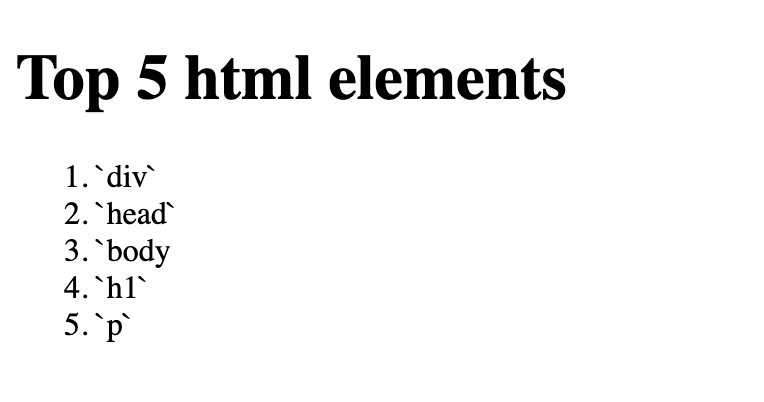
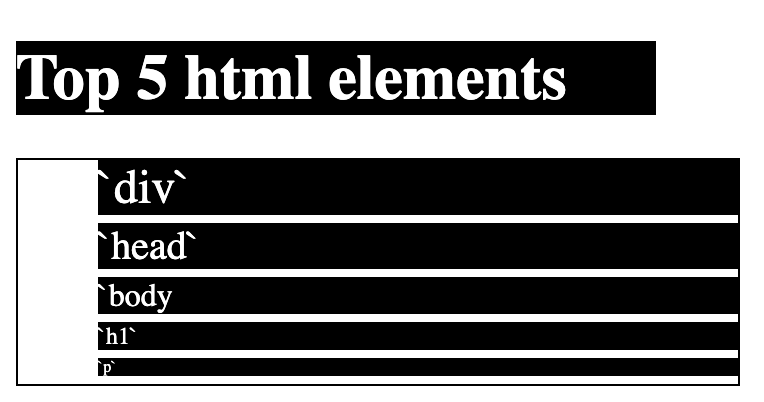

# Technical Writing Assignment

For guidance on setting up and submitting this assignment, refer to the Marcy lab School Docs How-To guide for [Working with Short Response and Coding Assignments](https://marcylabschool.gitbook.io/marcy-lab-school-docs/fullstack-curriculum/how-tos/working-with-assignments#how-to-work-on-assignments).

## Prompt 1

Do some research on semantic and non-semantic elements and share your findings. Your response should include:

- Examples of semantic and non-semantic tags
- The differences between semantic and non-semantic tags
- The benefits of using semantic tags (when possible)

### Response 1

The technical difference between semantic and non-semantic tags are as obvious as their names suggest: the former is more explicit and purposeful (in the sense their tags convey a clear and specific meaning) while the latter is the opposite--implicit and rather _free_ in usage.

We can see this more clearly when we list out some tags belonging to both.

**Non-Semantic Tags**

1. `<div>` - _division_ (?)
2. `<span>` - _span_ (??)

**Semantic Tags**

1. `<h#>` - _h_ for _heading_, and a corresponding _# (number)_ to it
2. `<ol>` - _ordered list_.
3. `<section>` - a _section_ of similarly related content
4. and so on...

While one could create sites entirely out of non-semantic tags and get away with it by clever use of `ids` and `classes`, the end product would suffer in terms of accessibility and search-engine-optimization. Non-semantic tags, independent of them being an alternative to their semantic counterparts, still carry an important use in styling and when there is a need to split off a semantic element by itself.

## Prompt 2

Do some research on accessibility. What are some ways to make your website more accessible? Explain why it is important for developers to create websites that meet accessibility standards.

### Response 2

There are a lot of ways to develop websites with consideration to **a11y**, and the bulk of it is in using semantic elements as much as possible. Web browsers index and arrange webpages based on these tags, and semantic tags create a proper and easier to follow accessibility tree (like the [code examples](https://github.com/The-Marcy-Lab-School/2-0-3-accessibility-html-best-practices) on [marcydocs/a11y](https://marcylabschool.gitbook.io/marcy-lab-school-docs/fullstack-curriculum/mod-2-html-css-dom/4-accessibility#part-0-why-a11y)). `ARIA` labels can also make some vague semantic tags (like `sections`, etc...) convey more meaning _(and, in a way, let non-semantic tags create a proper accessibility trees but that's just taking one step back...)_. In terms of styling, using `rem` units instead of absolute `px` units may also help by avoiding instances where the user may have to zoom in/out.

## Prompt 3

It is possible to add "inline" CSS styles to our html elements using the `style` attribute like so:

```html
<p style="color: red;">hello world</p>
```

While this is possible, it is a best practice to instead write styles in a separate CSS file. Provide at least one argument for why it _might_ be considered useful to write inline styles, and then provide a more compelling argument for writing styles in a separate CSS file.

### Response 3
One of the few arguable uses of inline-css is the difference in performance, but that's not often a concern in modern sites catering to modern devices. Writing CSS in a separate file instead provides a lot more flexibility and organization as the webpage gets larger. Being able to classify elements into similar styles is one of the larger benefits of it.

## Prompt 4

Imagine you are teaching a brand new programmer a brief lesson about the `class` and `id` attributes in HTML as well as how to use them to style elements using CSS. Your lesson should have the following components:

* An explanation of the concept of "classes" and "ids" with an analogy.
* An example of the usage using an HTML code block and a CSS code block.
* An explanation of the syntax using the terms: **attribute**, **selector** 

### Response 4
The simplest way to describe the relationship between `HTML` and `CSS` is that `HTML` outlines the generic layout and its corresponding `CSS` provides specific instructions on how they're displayed. In a sense, `CSS` is not necessary for functionality, but is crucial in creating a more engaging and user-friendly experience.

In order for `CSS` to apply styles to its corresponding `HTML`, it needs markers, which may come in the form of `tags` themselves (ie. `body`, `div`, `p`, etc.), and most importantly, in either `classes` or `ids`.

`Classes` and `Ids` are as semantically straightforward as they can get: we utilize `classes` in order to categorize elements--intuitively used for styling elements that are similar either in functionality or in hierarchy. `Ids` would then be used to pinpoint specific elements which need a styling catered only to that individual element (for when we need a specific element to _stand out_ in a class!). We use `selectors` to pinpoint said elements by their `class` and `id`.

Both `classes` and `ids` are few of many `attributes` that you can attach to any element. A simple way to look at `attributes` is that they're fields to hold any **data** that we want elements to hold.

Let's look at an ordered list in `HTML` for example:

```html
<h1>Top 5 html elements</h1>
<ol>
    <li class="top5-html-elements" id="number-1">`div`</li>
    <li class="top5-html-elements" id="number-2">`head`</li>
    <li class="top5-html-elements" id="number-3">`body</li>
    <li class="top5-html-elements" id="number-4">`h1`</li>
    <li class="top5-html-elements" id="number-5">`p`</li>
</ol>
```
And how it renders without `CSS` applied:



Now let's spice it up (only slightly) with some `CSS`:

```css
* { width: 320px; }
h1 {
  color: #ffffff;
  background-color: #000000;
}

ol { border: 1px solid black; }

li.top5-html-elements {
  color: #ffffff;
  background-color: #000000;
  margin-bottom: 4px;
}

li#number-1 { font-size: 16px; }

li#number-2 { font-size: 15px; }

li#number-3 { font-size: 14px; }

li#number-4 { font-size: 13px; }

li#number-5 { font-size: 12px; }
```

And now it looks like some broken piano part:



If you haven't already noticed, all a `CSS` file consists of is defining rules for specific `tags` or elements with `class`/`id` `attributes`. The syntax in which it does it...

```css
p.className#idName {
  /* YOUR STYLES HERE */
}
```

...makes use of `selectors`. In this specific example, we are **selecting** elements with tag `p`, class `className`, and id `idName`. So yeah... even `selectors` mean what it reads as... pretty neat...

## Prompt 5

The Document Object Model (DOM) API provides functions for manipulating HTML documents. It is possible to build an entire website using only JavaScript and the DOM API, however is that the best practice?

When building a website, how can I decide which content I should write using HTML/CSS and which content I should create using the JavaScript and the DOM API?

### Response 5
The DOM API makes it absolutely possible to build entire websites using only `JavaScript`. The reason why we one should not just skip `html` entirely is because... it's just plain inefficient. If you're trying to make a static website whose content does not have to change at all, hardcoding it with `html` just saves you time, effort, and lines of code written for basically the same result.

And with that, it becomes more obvious (in an intuitive way) that we will tend to rely on `JavaScript` for when we want our websites to change over time--and this includes not only changes in response to user input, but also changes in response to external dependencies (i.e. your website needing to pull the most current weather information [from external sources] every time someone visits it).